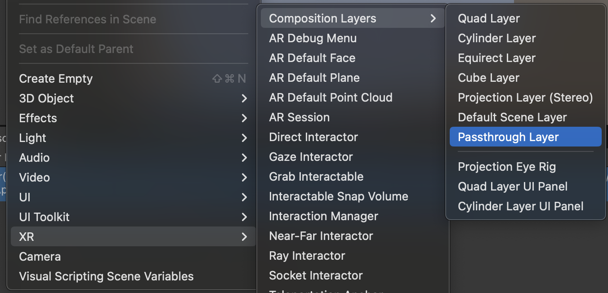
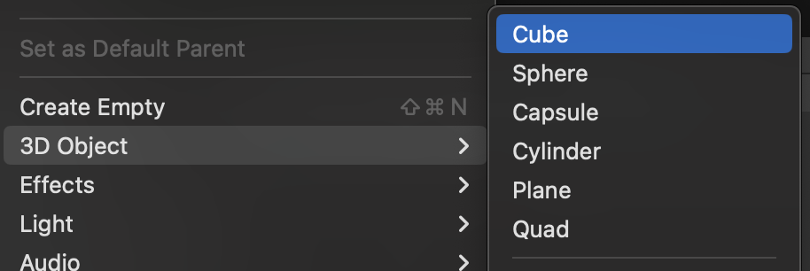
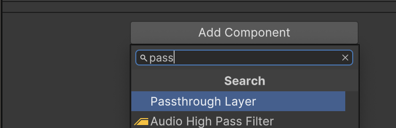
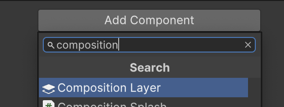

# Composition Layer Passthrough Sample

Demonstrates the Composition Layer Passthrough Feature at OpenXR runtime target
Android Platform.

## Turn on Composition Layer Passthrough feature

To install XR Composition Layer Package version 2.0.0:

*   Navigate to **Window** > **Package Manager**.
*   Click **Add** button "+", and select **Install package by name...**
*   Type package name `com.unity.xr.compositionlayers` and version `2.0.0`.
*   Click **Install** button.

To enable this sample:

*   Navigate to **Edit** > **Project Settings** > **XR Plug-in Management** >
    **OpenXR**.
*   Switch to the **Android** platform tab.
*   Select **Android XR (Extensions): Session Management**.
*   Select **Android XR (Extensions): Passthrough Composition Layer**.
*   Select **Composition Layers Support** from **All Features**.
*   Under **XR Plug-in Management > Project Validation**, fix all **OpenXR**
    related issues. This will help to configure your **Player Settings**.

You can now try to build `Passthrough.unity` scene and run this sample on
devices.

## Add Passthrough Composition Layer to the scene

Add a Passthrough Composition Layer to a scene by adding a GameObject with
`CompositionLayer` component and selecting layer type **Passthrough (Android
XR)**. You can add layers in the Editor or at runtime.

### Add a Passthrough Composition Layer in the Editor

In the Editor, you can add a Passthrough Composition Layer in the following
ways:

1.  Add a new GameObject containing the passthrough layer component using Unity
    Editor menu: **Gameobject > XR > Composition Layer > Passthrough Layer**. It
    defaults to sphere mesh and can be edited in the `MeshFilter` component.

    

2.  Add a 3D object with a built-in mesh using Unity Editor menu: **Gameobject >
    3D Object**.

    

    Then add a passthrough layer component to this game object by selecting the
    object in the Scene **Hierarchy** window and using the **Add Component**
    button. In the **Add Component** menu, choose **XR > Component Layers >
    Composition Layer > Passthrough Layer** or search by **Passthrough Layer**.

    

    Then choose a valid mesh in **MeshFilter** component.

3.  Add a Composition Layer component to an existing GameObject using the **Add
    Component** button in the Inspector window. In the **Add Component** menu,
    choose **XR > Component Layers > Composition Layer** or search by
    **Composition Layer**.

    

    Select **Passthrough (Android XR)** from **Layer Type** dropdown.

    

    Click **Yes** for the **Suggested Layer Extensions**. It will add the
    requirement component `MeshFilter`. Then choose a valid mesh in the
    `MeshFilter` component.

### Remove a Passthrough Composition Layer in the Editor

To remove the layer from the scene, delete its parent GameObject or the layer
component and any associated components.

You can temporarily disable a layer by deactivating its parent game object or
the component.

### Add a Passthrough Composition Layer at runtime

Add a Passthrough Composition Layer component at runtime with the GameObject
`AddComponent` method.

```
public static void AddPassthroughLayer(GameObject parent, Mesh meshForPassthrough)
{
    // Add a CompositionLayer component to the GameObject
    CompositionLayer layer = parent.AddComponent<CompositionLayer>();

    // Set up the layer
    if (layer != null) // layer was successfully created
    {
        // Set the layer data type
        layer.ChangeLayerDataType(typeof(XRPassthroughLayerData));

        // Required: Add MeshFilter component and set a valid mesh.
        layer.AddSuggestedExtensions();
        MeshFilter meshFilter = parent.GetComponent<MeshFilter>();
        meshFilter.mesh = meshForPassthrough;
    }
}
```

### Remove a Passthrough Composition Layer at runtime

Remove a Passthrough Composition Layer from a scene by destroying the
`CompositionLayer` component and any associated extension components. You can
also destroy the parent GameObject, which automatically destroys any associated
components.

```
public static void RemovePassthroughLayerFromGameObject(GameObject parent)
{
    CompositionLayer layer = parent.GetComponent<CompositionLayer>();
    if (layer != null && layer.LayerData is XRPassthroughLayerData)
    {
        // First destroy any extensions.
        Component[] extensions = parent.GetComponents<CompositionLayerExtension>();
        foreach (Component extension in extensions)
        {
            GameObject.Destroy(extension);
        }

        // Then destroy the layer
        GameObject.Destroy(layer);
    }
    else
    {
        Debug.LogWarning("Tried to remove a passthrough layer from a GameObject that has none.");
    }
}
```
